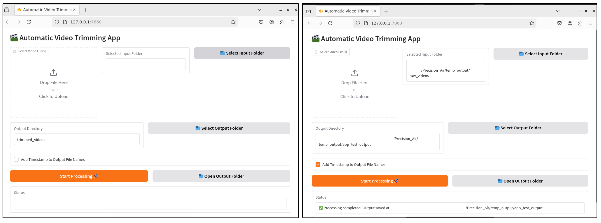
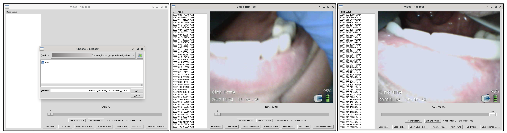

# src/app

This directory holds the automatic trimming script, the interactive UI, and manual editing tools for VLS video cleaning.

## Contents

- **Automatic Trimming Script**  
  `auto_trim_video.py`  
  Uses a ResNet-18 model to detect procedural frames, smooth predictions, and trim videos with optional timestamping, batching via CSV, and app-mode logging.

- **Trim + Detect Pipeline**  
  `auto_trim_and_detect.py`  
  First trims via the ResNet-18 classifier, then runs a YOLO model to detect faces/persons, applies blurring or overlays bounding boxes, and saves final videos.

- **Interactive UI**  
  `ui_app.py`  
  Launches a Gradio app for uploading videos, configuring trimming and detection options, and running the full pipeline.

- **Manual Tools**  
  In `manual_tools/`, scripts for frame-level trimming and face/person blurring.

---

## Installation

Ensure Python 3.8+ and install dependencies:
```bash
pip install -r requirements.txt
```

## Configuration

All scripts read from a combined `config_trim_detect.yaml` (or override via CLI flags).

Example `config_trim_detect.yaml`:
```yaml
paths:
  output_base_dir: "/data/mskscratch/users/ghoyer/Precision_Air/VLS_auto_trimmer/outputs"
  trimmed_vid_dir: "/data/mskscratch/users/ghoyer/Precision_Air/temp_output/trimmed_videos"

inference:
  classification_weights_path: "run_20250417_015644/checkpoints/best_model.pt"
  yolo_weights_path: "face-detection-yolov8/yolov8_run_20250414_225903/weights/best.pt"

auto_trim:
  threshold: 5
  confidence_threshold: 0.7
  smoothing_window: 10
  csv_path: "/data/mskscratch/users/ghoyer/Precision_Air/air_loc_0308.csv"

yolo:
  conf_adjust_range: [0.3, 0.9]
  blur_only: False
  blur_kernel: [51, 51]
  target_classes: null

pipeline:
  log_file: "logs/pipeline.log"
```

- **`paths.output_base_dir`**: root for all outputs
- **`paths.trimmed_vid_dir`**: where trimmed videos go
- **`inference.*_weights_path`**: paths to classifier & YOLO checkpoints
- **`auto_trim`**: trimming parameters
- **`yolo`**: detection/blurring parameters
- **`pipeline.log_file`**: log filepath

---

## Usage

### 1. Automatic Trimming

```bash
python -m src.app.auto_trim_video \
  --config_file config_trim_detect.yaml \
  [--input_path /path/to/video_or_folder] \
  [--output_dir /path/to/output] \
  [--threshold 5] \
  [--confidence_threshold 0.5] \
  [--smoothing_window 5] \
  [--add_timestamp] \
  [--app_mode] \
  [--csv_path /path/to/videos.csv] \
  [--max_rows 10]
```
- Override any config in CLI if needed.

To trim a single video using procedural frame classification:
```bash
python -m src.app.auto_trim_video --input_path /path/to/video.mp4 --output_dir trimmed_videos
```

To trim a single video with a timestamp in the output file name:
```bash
python -m src.app.auto_trim_video --input_path /path/to/video.mp4 --output_dir trimmed_videos --add_timestamp
```

### 2. Trim + Detect Pipeline
```bash
python -m src.app.auto_trim_and_detect \
  --input_path /path/to/video.mp4 \
  --output_dir /path/to/output \
  [--threshold 5] \
  [--confidence_threshold 0.7] \
  [--smoothing_window 10] \
  [--add_timestamp] \
  [--app_mode] \
  [--csv_path /path/to/videos.csv] \
  [--max_rows 5] \
  --class_weights_path /path/to/classifier.pt \
  --yolo_weights_path /path/to/yolo.pt \
  [--yolo_conf_adjust_range 0.3 0.99] \
  [--yolo_blur_only] \
  [--yolo_blur_kernel 51 51] \
  [--yolo_target_classes person face]
```
- classifier flags (`--threshold`, `--confidence_threshold`, `--smoothing_window`, `--add_timestamp`, `--app_mode`, `--csv_path`, `--max_rows`) behave as above
- `--class_weights_path` : path to ResNet-18 checkpoint
- `--yolo_weights_path` : path to YOLO model checkpoint
- `--yolo_conf_adjust_range` : min/max confidence for YOLO (default: 0.3 0.99)
- `--yolo_blur_only` : blur regions without drawing boxes
- `--yolo_blur_kernel` : Gaussian blur kernel size (e.g. 51 51)
- `--yolo_target_classes` : list of YOLO class IDs or names to process

### 3. Interactive Interface
```bash
python -m src.app.ui_app --config_file config_trim_detect.yaml
```
1. Select video files or a folder
2. Choose output directory
3. (Optional) Toggle Add Timestamp
4. Click Process to run automatic trimming


*Automatic trimming UI.*

## Manual Tools
Inside `src/app/manual_tools/`:

- `video_trim_tool.py` – frame-by-frame trimming utility
- `video_blur_tool.py` – manual blur selector for privacy

### Frame Trimmer GUI
```bash
python -m src.app.manual_tools.video_trim_tool
```
- **Load Video / Folder**: queue one or many files
- **Slider & Buttons**: step through frames, set start/end trim points
- **Save Trimmed Video**: choose save location and export

*Set start/end frames and export trimmed clip.*


*Manual Trim Tool UI.*

### Blur Tool GUI
```bash
python -m src.app.manual_tools.video_blur_tool
```
- **Draw Rectangles**: click-drag to define blur regions per frame
- **Blur Level Slider**: adjust Gaussian kernel size
- **Undo/Redo**: revert or reapply region edits
- **Save Video**: export anonymized video with all blurs applied

*Draw and preview blur regions before saving.*


*Manual Blur Tool UI.*

## Packaging for Distribution
```bash
nuitka --standalone \
  --include-package=src.app \
  --include-package=src.utils \
  --output-dir=dist \
  src/app/ui_app.py
```

